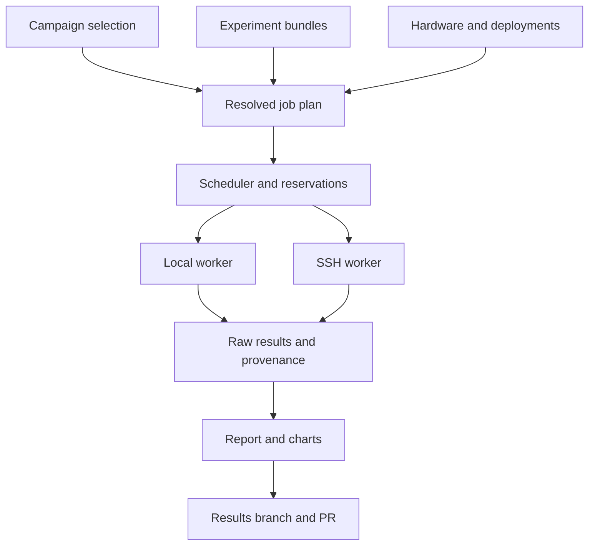

# Campaign architecture

```mermaid
flowchart TD
  campaign["Campaign selection"]
  experiments["Experiment bundles"]
  profiles["Hardware and deployments"]
  plan["Resolved job plan"]
  scheduler["Scheduler and reservations"]
  local["Local worker"]
  remote["SSH worker"]
  records["Raw results and provenance"]
  reports["Report and charts"]
  pr["Results branch and PR"]
  campaign --> plan
  experiments --> plan
  profiles --> plan
  plan --> scheduler
  scheduler --> local
  scheduler --> remote
  local --> records
  remote --> records
  records --> reports
  reports --> pr
```
