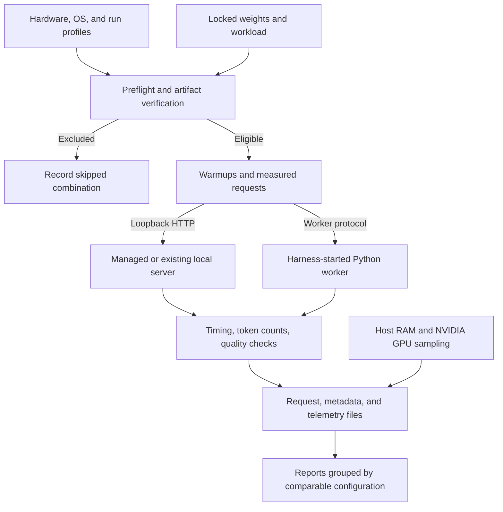

# Evaluation workflow

```mermaid
flowchart TD
    Config["Hardware, OS, and run profiles"] --> Check["Preflight and artifact verification"]
    Inputs["Locked weights and workload"] --> Check
    Check -->|Excluded| Skip["Record skipped combination"]
    Check -->|Eligible| Run["Warmups and measured requests"]
    Run -->|Loopback HTTP| Server["Managed or existing local server"]
    Run -->|Worker protocol| Worker["Harness-started Python worker"]
    Server --> Metrics["Timing, token counts, quality checks"]
    Worker --> Metrics
    Metrics --> Files["Request, metadata, and telemetry files"]
    Sensors["Host RAM and NVIDIA GPU sampling"] --> Files
    Files --> Report["Reports grouped by comparable configuration"]
```

[View PNG rendering](evaluation-workflow.png).
