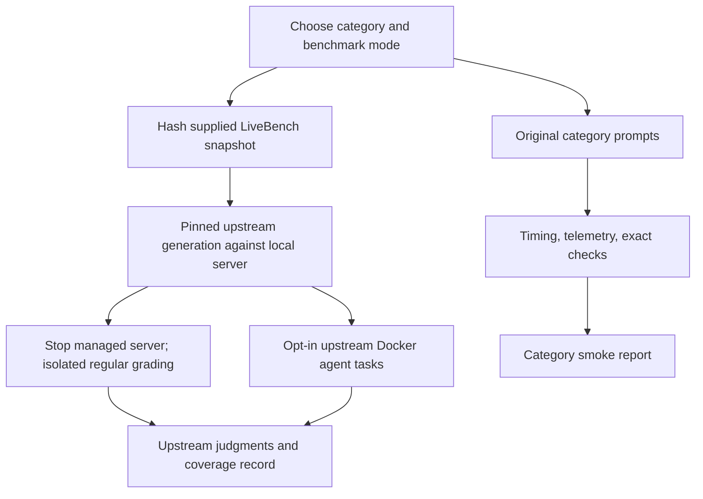

# LiveBench workflow

```mermaid
flowchart TD
    Select["Choose category and benchmark mode"] --> Smoke["Original category prompts"]
    Select --> Snapshot["Hash supplied LiveBench snapshot"]
    Smoke --> Metrics["Timing, telemetry, exact checks"]
    Snapshot --> Generate["Pinned upstream generation against local server"]
    Generate --> Regular["Stop managed server; isolated regular grading"]
    Generate --> Agentic["Opt-in upstream Docker agent tasks"]
    Regular --> Scores["Upstream judgments and coverage record"]
    Agentic --> Scores
    Metrics --> Local["Category smoke report"]
```

[View PNG rendering](livebench-workflow.png).
