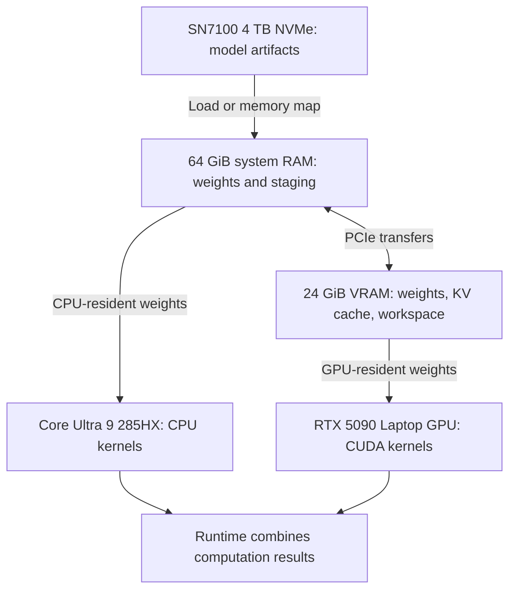

# Memory offload

```mermaid
flowchart TD
    SSD["SN7100 4 TB NVMe: model artifacts"] -->|Load or memory map| RAM["64 GiB system RAM: weights and staging"]
    RAM -->|CPU-resident weights| CPU["Core Ultra 9 285HX: CPU kernels"]
    RAM <-->|PCIe transfers| VRAM["24 GiB VRAM: weights, KV cache, workspace"]
    VRAM -->|GPU-resident weights| GPU["RTX 5090 Laptop GPU: CUDA kernels"]
    CPU --> Results["Runtime combines computation results"]
    GPU --> Results
```

[View PNG rendering](memory-offload.png).
