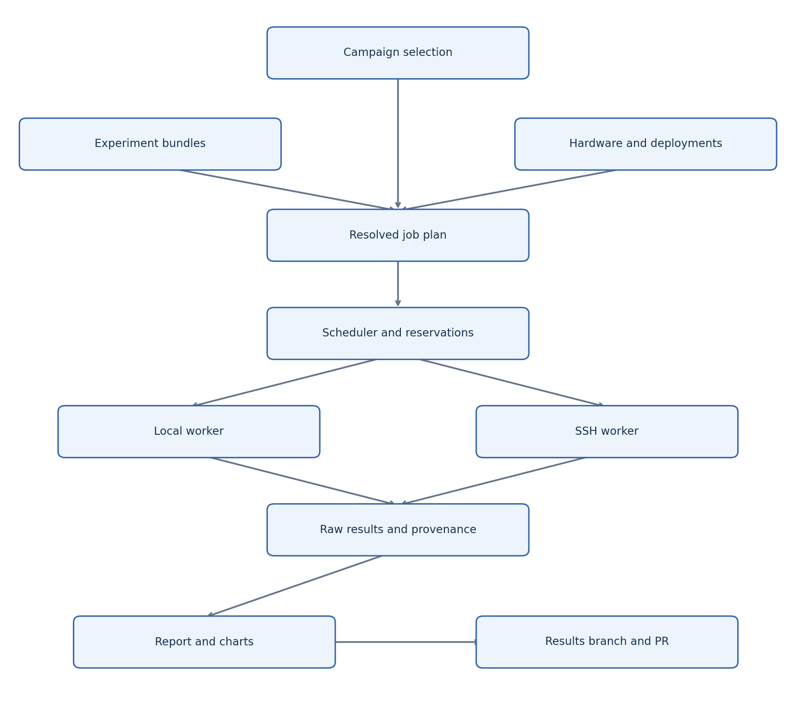

# Experiment campaigns

A campaign binds versioned experiment cases to actual hardware configurations. A case can refer to the same model as another case while changing its placement, workload or routing policy. Existing single-run commands remain supported.

## Configuration model

| Object | Meaning |
|---|---|
| Experiment bundle | `experiments/ID/experiment.json` names the version, modes and case aliases. |
| Case | JSON containing `id` and `parameters`; a case alias or file path selects it. |
| Inventory | JSON containing dictionaries named `targets` and `hardware_configs`. |
| Target | Actual worker environment with `transport` and `physical_host_id`; local or SSH. |
| Hardware configuration | Target, `hardware_profile`, `os_id`, optional `overrides` and `attestation`. |
| Phase | Experiments that may overlap; `depends_on` lists earlier phases. |
| Job | One case/hardware binding; owns unique attempt directories. |

Paths resolve relative to the declaring file. Built-in aliases resolve relative to the experiment bundle. Case `config` paths refer to existing offload run JSON. Runtime files (`suite`, `artifact_lock`, `replay`, `benchmark_registry`) are hashed and checked on workers. Settings remain separate from observed host telemetry. Unknown schema fields fail validation.

See [a combined campaign](../campaigns/offload-and-routing.example.json). Fill all model provenance and hardware observations before real runs. Keep personal files in ignored `configs/local/`; copying a case there requires adjusting its relative paths.

The example's offload phase finishes before its routing phase. Remove the dependency to permit independent experiments to overlap. `--max-parallel-jobs 1` makes execution globally serial. Larger values permit overlap only when resource ownership allows it. Request concurrency inside the two initial experiments remains 1. Setup's legacy `--jobs` means build threads, not campaign jobs.

## Run and recover

```bash
llm-eval plan --campaign configs/local/campaign.json
llm-eval setup --campaign configs/local/campaign.json
llm-eval run --campaign configs/local/campaign.json --max-parallel-jobs 2
llm-eval status --campaign-dir results/campaign-ID
llm-eval cancel --campaign-dir results/campaign-ID
llm-eval resume --campaign-dir results/campaign-ID
llm-eval resume --campaign-dir results/campaign-ID --retry-failed
```

Planning creates no run directory and makes no installation/download/inference calls. Setup installs unique runtime prerequisites using existing pinned recipes. Model downloads still require the explicit legacy download manifests; campaign selection alone never downloads weights. Routing deployment endpoints are externally prepared; the original offload experiment additionally supports owned managed servers.

The wizard asks for experiment(s), case(s), mode, inventory, hardware selections, phase ordering, concurrency and report publication. Existing platform wrappers keep their defaults and reject conflicting campaign selections. Use `--campaign-wizard` to request the generic wizard explicitly.

Campaign state is an atomically replaced JSON journal (`campaign.json`), with a separate immutable resolved plan. The coordinator takes an OS process lock. Workers take persistent physical-host reservations. Each attempt has a unique directory and retains raw data, process diagnostics and its result. Completed jobs are not rerun on resume. Failed or cancelled jobs require `--retry-failed`; retries create new attempts and may incur new API charges.

An SSH disconnect leaves a job **lost** and keeps reservations. Resume queries its worker, collects completed artifacts, and releases ownership only after completion is confirmed. Reservation intent is journaled before acquisition; a connection lost before submission can be reconciled without launching duplicate work. A reservation does not expire just because a heartbeat is old. If a host died before recording completion, stop/reconcile owned processes and inspect its reservation files before any operator recovery; do not delete an active reservation. Failed dependencies leave dependent jobs blocked.

After starting an unavailable boot environment, resume its campaign. If its target was declared `available: false`, admit it explicitly with `llm-eval resume --campaign-dir DIR --enable-target TARGET_ID`. This records availability in campaign state without changing the immutable workload plan. The actual OS/revision checks still apply.

Exit status is 0 only when evaluations and enabled reporting complete successfully, 1 for failed/incomplete work, 2 for configuration/setup errors, and 130 for cancellation. Measurement status and report/publication status are recorded separately.

## Hardware and isolation

Hardware profiles live in `configs/hardware/`. CPU thread limits, GPU capacity, reserves, CUDA architecture and OS-specific RAM limits come from the profile. The original laptop remains the default for legacy configurations. Real runs verify the selected GPU and record telemetry; observations and operator attestations describe remaining BIOS/power/storage details.

A target has a **physical** identity, not just an OS name. Use the same `physical_host_id` for native Windows and WSL on the same laptop. WSL requires a `lock_root` referring to a folder shared with its native Windows worker, such as matching Windows `C:/llm-eval-locks` and WSL `/mnt/c/llm-eval-locks` paths. All workers accessing the same machine must use the same physical identity and shared lock authority. Dual-boot OSes cannot run simultaneously.

The initial scheduler reserves whole hosts for isolated measurements. It intentionally rejects a shared-host contention policy. Separate GPUs in one chassis still share RAM, CPU, disk and power resources. Memory limits are planning/launch controls, not guaranteed OS enforcement. A future contention experiment can add an explicit policy and separate result cohorts.

A live routing candidate can declare `target_id` referring to another target in the inventory. Its physical host joins the job's reservations even if it has no independent experiment job. The endpoint itself must already be served. `target.resource_hosts` adds explicitly reserved host identities. External endpoint telemetry is not fabricated: worker telemetry measures the execution target; the report identifies external deployments from configuration.

## Multiple machines over SSH

Install this harness, its telemetry/reporting dependencies and the **same clean Git revision** in every target environment. Configure noninteractive SSH authentication outside the campaign. Use an SSH config alias and a Python executable without shell metacharacters; the remote Python must be able to import `llm_eval` before reading the RPC request.

Example target inside an inventory:

```json
{
  "transport": "ssh",
  "physical_host_id": "gpu-server",
  "host": "eval-server",
  "python": "python3",
  "repo_root": "/opt/llm-eval",
  "work_root": "/srv/llm-eval-runs",
  "path_mappings": {
    "/local/models": "/srv/models"
  }
}
```

Bind it to a hardware configuration with a real server profile and OS ID. The default OS catalog covers the original native Ubuntu/Windows/WSL environments; add and validate profiles before using another OS. SSH also supports a prepared Windows OpenSSH target with a suitable Python executable and Windows-native paths. The code supports that transport; real Windows/WSL and multi-machine acceptance must be performed on the operator's hardware.

The coordinator automatically maps repository paths; `path_mappings` maps other artifact/workload roots. Configuration contains environment-variable **names**, never credential values. Remote collection rejects traversal, symlinks and checksum mismatches. Artifact collection uses bounded 4 MiB chunks, verifies SHA256, and reuses already collected matching files on retry. The default total cap is 2 GiB per attempt; set target `max_collection_bytes` for larger suites. Insufficient disk space or a cap violation preserves the remote artifacts and requires collection/reconciliation before resume can finish.

## Costs and reproducibility

Hosted routing deployments require explicit HTTPS allowlists, pricing and a per-job `budget_usd`. An optional campaign `execution.api_budget_usd` must cover the sum of all admitted job budgets; planning prints `total_api_reservation_usd`. A failed call retains its reserved cost because server-side completion may be uncertain. Provider-specific billing and rate limits still apply; 429 responses are recorded as failed requests without automatic retry. Request concurrency remains 1 per job.

Reports distinguish actual client/decision timing from replayed generation-time estimates. Warmups, retries, missing grades, incompatible benchmark releases and synthetic fixtures retain their labels. Use the same pinned workload, grader, model representation and settings before comparing scores.


