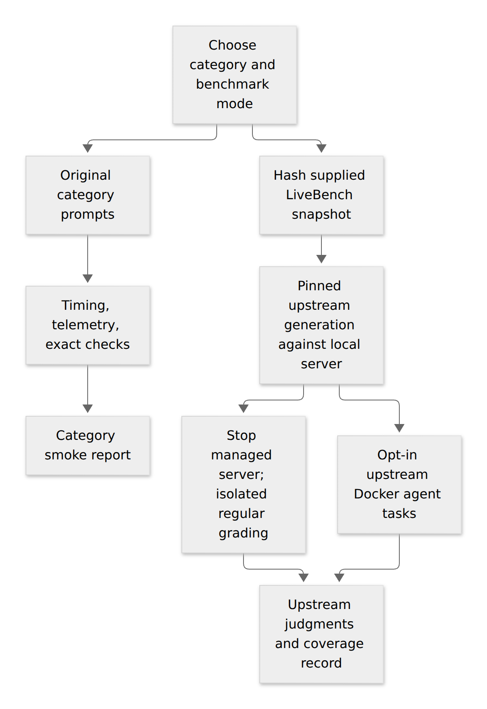

# LiveBench categories and model selection

Evidence checked **2026-10-05**. The [LiveBench leaderboard](https://livebench.ai/) selects release **2026-06-25**. Its [versioned category definition](https://github.com/LiveBench/new-livebench/blob/caa4253c8a3aa93b5c7ec234e681d4f120a20240/public/categories_2026_06_25.json) has **seven categories and 23 tasks**, including Agentic Coding. The older upstream README's six-category description is not the current leaderboard taxonomy.

## What this project runs

| Category ID | Leaderboard category | Tasks in the reference release | Local category smoke checks |
|---|---|---|---|
| `reasoning` | Reasoning | theory_of_mind, zebra_puzzle, spatial, logic_with_navigation | Ordering, implication, navigation |
| `coding` | Coding | code_generation, code_completion | Read code, select a boundary fix, produce structured output |
| `agentic_coding` | Agentic Coding | javascript, typescript, python | **Static planning proxy only:** select a file, next action, and edit scope |
| `math` | Mathematics | AMPS_Hard, integrals_with_game, math_comp, olympiad | Exact arithmetic, algebra, probability |
| `data_analysis` | Data Analysis | consecutive_events, tablejoin, tablereformat | Join, aggregate, sort |
| `language` | Language | connections, plot_unscrambling, typos | Meaning, event order, spelling |
| `instruction_following` | Instruction Following | paraphrase, simplify, story_generation, summarize | Exact formatting, JSON schema, extraction |

The category definitions are in [catalog/benchmarks.json](../catalog/benchmarks.json). Each local suite has three original deterministic checks. They establish basic functionality and provide repeated timing samples; they are too small to rank model intelligence. These are **not copied LiveBench questions, official scores, or an equivalent replacement for LiveBench**. A reasoning model can fail an exact-output smoke check by emitting extra commentary; retain that distinction when interpreting failures.

Two explicit run modes prevent accidental score conflation:

| Run option | Inputs and grading | Supported adapters | Outputs |
|---|---|---|---|
| `--benchmark category-smoke` | Original committed prompts; exact/JSON checks; no generated code execution | All nine platforms, subject to OS/model gates | Request timings, telemetry, task and category summaries |
| `--benchmark livebench` | User-supplied LiveBench question/test-case snapshot and pinned upstream scorer | The seven OpenAI-compatible server platforms; Ollama uses its compatibility endpoint | Upstream answers/judgments/reports, dataset hashes, scorer revision, image ID, logs |

Accelerate and AirLLM use category-smoke in this integration; their worker protocol is not an OpenAI server. Running upstream LiveBench against them requires a separately implemented server adapter. Local category pass rates are never added to upstream scores. Upstream runs do not currently generate the core harness's per-request latency/telemetry report; pair them with category-smoke performance runs at the same settings. Upstream generation persists full questions/answers regardless of the core `save_outputs` setting.



## Running upstream LiveBench

First complete the [platform setup and artifact preparation](WORKFLOWS.md). Setup can install a separate LiveBench environment and build its grading image:

```bash
python scripts/setup.py --non-interactive --platform llama.cpp --os ubuntu-26.04-native \
  --models deepseek-r1-32b --with-livebench --build-livebench-image llm-eval-livebench:2026-06-25
```

Use a **new prefix** if the existing installation was created without `--with-livebench`. The exact plan is immutable at a given prefix. [Docker Engine](https://docs.docker.com/engine/install/) or [Docker Desktop](https://docs.docker.com/desktop/setup/install/windows-install/) with Linux containers is required for grading. A native Windows inference run with a Linux grading container remains native Windows **inference**; document the separate grading environment. Prefer Linux/WSL for the experimental Agentic Coding pipeline.

Obtain the questions from [LiveBench's published datasets](https://huggingface.co/livebench) using its [pinned downloader](https://github.com/LiveBench/LiveBench/blob/8f8e5c381a16e3f24257776edd53471fe86f8091/livebench/download_questions.py). For example, from the repository root after the setup above:

```bash
cd .platforms/ubuntu-26.04-native/llama.cpp/livebench-source/livebench
../../livebench-venv/bin/python download_questions.py
cd ../../../../..
```

On Windows the matching interpreter is `..\..\livebench-venv\Scripts\python.exe`. This is an explicit online data-download step, separate from inference; the upstream downloader may retrieve all available categories. Its public data can lag the newest leaderboard. Retain the supplied `question.jsonl` and any adjacent `test_cases_*.jsonl`, record dataset revision/source, and inspect coverage before use. The run script hashes both question and test-case files and reads local JSONL only; it does not quietly fall back to an online dataset. It rejects categories with zero eligible questions, unsupported release dates, and duplicate question IDs.

The data root must contain `live_bench/CATEGORY/TASK/question.jsonl`. Agentic data uses `agentic_coding_v2` where present, with the older `agentic_coding` path accepted for older snapshots. Pass the **data root**, not the repository root:

```bash
python scripts/run.py --non-interactive --config configs/local/deepseek-32b.json \
  --benchmark livebench --categories reasoning,coding,math,data_analysis,language,instruction_following \
  --livebench-release 2026-06-25 \
  --livebench-data .platforms/ubuntu-26.04-native/llama.cpp/livebench-source/livebench/data \
  --livebench-image llm-eval-livebench:2026-06-25 --context 8192 --max-tokens 4096
```

LiveBench requests preserve the configured loopback address (including IPv6) and any `/v1` route prefix. Ollama's `/api/chat` endpoint maps to its `/v1` compatibility API. For a nonstandard route, set `livebench_api_base` explicitly in the run config; it must still be a literal loopback HTTP URL ending in `/v1`.

Each run creates a uniquely named local model configuration in its copied scorer source. That maps directly to the **exact, case-sensitive** `served_model` name; upstream cloud model aliases and preset overrides are not inherited. The generated mapping and its hash are recorded in `livebench-run.json`. Regular generation uses the supplied questions' required temperature when present, otherwise the pinned upstream default of zero; smoke-run `temperature`, `seed` and `request_options` are not automatically forwarded to this separate upstream lane. Agentic settings remain governed by the upstream pipeline. Record these differences before comparing scores.

The runner now requires one valid judgment for every eligible question in the supplied snapshot before producing reports or marking the run completed. Missing/duplicate judgments, nonfinite or out-of-range scores, and reported API/evaluation infrastructure errors fail the run and remain visible in `livebench-run.json` under `coverage`. A valid zero score remains a measured failure, not missing data. This completion gate checks the **supplied snapshot**, not whether it covers the entire public leaderboard release. Each category's CSV outputs are preserved separately under `reports/CATEGORY/`.

Use `--dry-run` to inspect commands and question counts. Full upstream runs require an installed LiveBench environment even in external-server mode. Install it using the same platform prefix and `--with-livebench`.

Regular generation explicitly uses upstream `--no-incremental-grading`; otherwise upstream can execute coding answers during generation on the host. This project defers grading to a container with no network, no capabilities, a read-only root and source/answer mount, writable judgment directories, an 8 GiB memory cap, eight CPU limit, and a 2 GiB temporary filesystem. It never mounts the Docker socket into that container. Managed servers stop before this regular grading phase; external servers are left running, so reserve additional memory or use managed mode. Container resource caps can cause grading timeouts or changed scores: record failures and rerun a separately labeled experiment if limits are changed. A container is defense in depth, not a guarantee against a kernel/container escape or benchmark manipulation.

**Agentic Coding is different:** `--allow-agentic-execution` explicitly opts into LiveBench's own Docker build/agent/test pipeline. The agent runs during generation; a subsequent upstream judgment pass exports its cached evaluations and may run remaining Docker tests. It needs additional disk/RAM and possibly network access to prepare task environments, and does not inherit the regular grader's limits. Review the pinned upstream pipeline; use a disposable dedicated Docker environment without personal repositories, secrets, or unrelated workloads. The harness does not globally prune Docker and cannot guarantee cleanup of upstream-created containers after cancellation. The original category-smoke proxy never starts these workloads. Upstream agent model configuration also controls turn/output limits; the generic `--max-tokens` cap applies to regular generation and is not a total agent-trajectory budget.

## Score interpretation

The [leaderboard averaging implementation](https://github.com/LiveBench/new-livebench/blob/caa4253c8a3aa93b5c7ec234e681d4f120a20240/src/Table/Averaging.js) first averages available task scores within each category and then averages category scores equally. Do not average all 23 task values equally to recreate its overall score. Do not create an overall rank across different releases or mix local smoke pass rates with those scores.

Before describing any local result as comparable with the leaderboard, establish identical release/task coverage, model checkpoint, template, precision, reasoning/sampling settings, generation budget, scorer revision, and dependency environment. Local 8K context and 4K output budgets may substantially constrain reasoning models; they are laptop experiments, not assumed leaderboard settings. A quantized model's score is not inherited from its source model. Public data coverage alone is not proof of access to the entire latest evaluation set. `livebench-run.json` keeps comparability **unverified** by default.

## Additional providers and models

The newest leaderboard's highest open-weight entries are often too large for this laptop. We inspected historical release tables as well to identify plausible offload candidates. The five additions below expand the catalog from 24 to **29 entries**. This is a selection for testing, not a ranking across releases. Source rows, task-averaged category scores, source table hashes and commit are in [catalog/livebench-evidence.json](../catalog/livebench-evidence.json); original model revision pins are in [catalog/models.json](../catalog/models.json).

| Provider and model | Catalog ID | Initial representation / estimated weight GiB | Published reference overall / release | Why add it |
|---|---|---|---|---|
| DeepSeek — [R1-Distill-Qwen-32B](https://huggingface.co/deepseek-ai/DeepSeek-R1-Distill-Qwen-32B) | `deepseek-r1-32b` | Q8_0 / 32.46 | 47.52 / 2025-04-25 | Moderate dense reasoning offload; compare with the existing Qwen/Gemma tier. |
| DeepSeek — [R1-Distill-Llama-70B](https://huggingface.co/deepseek-ai/DeepSeek-R1-Distill-Llama-70B) | `deepseek-r1-70b` | Q4_K_M / 39.45 | 55.51 / 2025-04-25 | A reasoning-focused counterpart to the existing Llama 70B anchor. Retain inherited Llama license terms. |
| Mistral AI — [Small 3.1 24B Instruct](https://huggingface.co/mistralai/Mistral-Small-3.1-24B-Instruct-2503) | `mistral-small31` | BF16 / 44.70 | 45.92 / 2025-04-25 | Apache-2.0 dense precision/capacity experiment. Quantized variants generally fit VRAM and should be controls. Text-only first. |
| Microsoft — [Phi-4 Reasoning Plus](https://huggingface.co/microsoft/Phi-4-reasoning-plus) | `phi4-reasoning-plus` | BF16 / 27.38 | 56.64 / 2025-04-25 | MIT reasoning precision/capacity test with comparatively small offload demand. Quantized variants are in-VRAM controls. |
| Z.AI — [GLM-4.5-Air](https://huggingface.co/zai-org/GLM-4.5-Air) | `glm45-air` | Q4_K_M / 61.75 | 60.53 / 2025-05-30 | **Conditional** sparse upper-budget test: 12B active does not mean only 12B stored. Published nominal size is 106B; tensor metadata is about 110.5B. |

Historical score sources: [2025-04-25 table](https://github.com/LiveBench/new-livebench/blob/caa4253c8a3aa93b5c7ec234e681d4f120a20240/public/table_2025_04_25.csv), [2025-05-30 table](https://github.com/LiveBench/new-livebench/blob/caa4253c8a3aa93b5c7ec234e681d4f120a20240/public/table_2025_05_30.csv). The June 2026 release is a different test set and must not be used as their score label.

Prioritize DeepSeek 32B Q8 and 70B Q4 for the dense offload comparison. Use Phi-4 and Mistral BF16 to probe precision/capacity and compare against their quantized controls. Attempt GLM only after verifying compact CPU expert storage and loader peaks; KTransformers needs a supported AVX2 recipe and representation. Any engine/model pairing can still fail architecture or quantization support. None of these five is admitted to Strata's currently restricted reference-model lane.

The latest [2026-06-25 table](https://github.com/LiveBench/new-livebench/blob/caa4253c8a3aa93b5c7ec234e681d4f120a20240/public/table_2026_06_25.csv) also supports retaining the existing [Qwen3.8-27B](https://huggingface.co/Qwen/Qwen3.8-27B) and [Qwen3.8-Flash-Next](https://huggingface.co/Qwen/Qwen3.8-Flash-Next) reference candidates. We do not add massive top-ranked checkpoints such as [GLM-5.3-Flash](https://huggingface.co/zai-org/GLM-5.3-Flash) merely because they score well: its nominal 320B parameters imply about 149 GiB at raw four bits, before overhead. Larger DeepSeek frontier models and closed API-only entries also fail this project's self-hosted hardware scope. SSD capacity is not a substitute for meeting the memory and usability gates.
